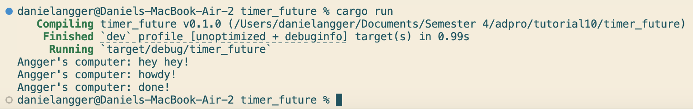
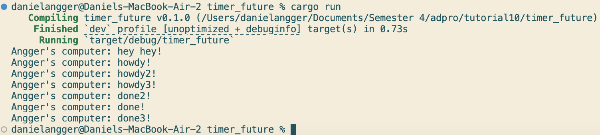
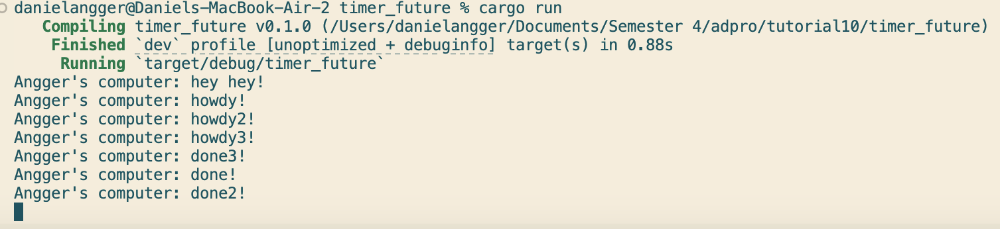

# Tutorial 1: Timer

## 1.2. Understanding how it works.

Pada kode ini, spawner.spawn(...) tidak langsung menjalankan task, tetapi hanya mengirim future ke task queue. Tetapi disini, println!("Angger's computer: hey hey!") dieksekusi langsung di thread utama, tanpa await, tanpa delay, langsung dijalankan. Dan akhirnya, executor.run() baru mengeksekusi task yang sudah dikirim ke queue. Di sinilah future dijalankan dan queue di dalamnya dieksekusi. Jadi urutan yang sebenarnya adalah spawner.spawn(...): mendaftarkan future ke task queue, belum dijalankan, lalu println!("Angger's computer: hey hey!"): langsung dieksekusi di thread utama — cepat, tanpa delay, terakhir barulah, executor.run() dijalankan.

## 1.3: Multiple Spawn and removing drop

Pada kode ini, jika tidak memanggil drop(spawner);, maka spawner masih hidup, sehingga channel (sync_channel) antara Spawner dan Executor tidak tertutup. Ini menyebabkan kode tidak akan pernah berhenti dieksekusi, karena executor mengira “mungkin masih akan ada task lain”. 

Lalu, urutan output juga menjadi acak. Hal ini karena ketiga task dijalankan secara bersamaan (concurrently) oleh executor, dimana masing-masing task menjalankan TimerFuture::new(Duration::new(2, 0)) — dan ini tidak memblokir secara sinkron, tetapi menunggu secara asynchronous. Setelah 2 detik, urutan task mana yang resume duluan ditentukan oleh race condition internal (siapa yang selesai tidur dan di-wake lebih dulu oleh timer thread). Maka done, done2, dan done3 bisa muncul dalam urutan berbeda-beda tiap run.

